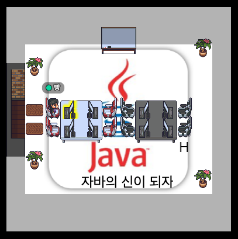

# 자바 스터디

## 사용 JDK
### AdoptOpenJDK 11
#### 다운로드 사이트
https://adoptopenjdk.net/

#### Version
1. Choose a Version : OpenJDK 11(LTS)
2. Choose a JVM : HotSpot

## 사용 교재
### 자바의 신
#### https://search.shopping.naver.com/book/catalog/32482010229?cat_id=50010920&frm=PBOKPRO&query=%EC%9E%90%EB%B0%94%EC%9D%98+%EC%8B%A0&NaPm=ct%3Dl72q3vv4%7Cci%3D07b17fd55e6973c944f6eb503a6a3428722bc683%7Ctr%3Dboknx%7Csn%3D95694%7Chk%3D141fa7d04aeed31bf6955e7a713ad98e92c1b94a
#### JDK 1.8 까지의 내용을 다루며 자바 기초를 다루기에 좋은 책
#### 1권 : 1~18장
#### 2권 : 19~36장

## 참여 인원
### 8명
#### 1팀, 2팀으로 나눌 예정

## 스터디 모임 장소
### 게더타운
#### 프로그램 설치
https://www.gather.town/download
#### 웹으로 들어갈 시 링크
https://app.gather.town/app/IkUdKUAtfbbl0nlO/java-study

## 스터디 기간
### 8주 ~ 12주

## 스터디 모임 시간
### 아직 미정

## 스터디 시간
### 발표 : 30~50분
### 질의응답 : 20~30분
### 예제 만들기 : 20~40분

## 학습 목표
### 자바의 기초를 탄탄히 하여, 자바를 처음 하는 사람에게도 문제 없이 충분히 설명할 수 있게 하는게 목표

## 학습 방법
#### 스터디 기간이 너무 길 시 루즈해져서 스터디가 흐지부지 될 수 있으므로 최대한 빠르게 치고 나가기
#### 1주마다 몇 챕터까지 나갈지는 매 스터디 종료 시마다 정하기
#### 팀마다 한 사람당 최소 한 장은 발표 준비
### 진행 방식
### 1. 사전에 정해진 챕터만큼 공부
### 2. A팀 B팀 한 주마다 돌아가면서 발표
#### 2-1. 각 챕터의 어떤 장을 누가 발표할지는 팀 내에서 협의
#### 2-2. 해당 팀 발표 주에는 해당 팀에서 한 명도 빠짐없이 발표 필수
### 3. 발표가 끝난 후 질의 응답
#### 3-1. 사전에 본인이 궁금한 부분 준비해서 물어봐도 무방
#### 3-2. 아무 질문도 안 하고 넘어가면 안 됨
### 4. 질의 응답 이후 지금까지 진행한 챕터를 가지고 각자 간단한 예제 만들어보기
#### 4-1. 예제 만들고 시연해보기
### 5. 마지막 장까지 진도가 나가면 마지막으로 팀 별로 간단한 자바 프로그램 만들어보기

## 발표 시 필수 내용
#### 1. 잘 모르는 부분이었지만, 이번에 공부하면서 확실히 알게 될 때 느낀점 말해보기
#### 2. 공부하면서 헷갈리거나 이해가 잘 안가는 부분이 있을 시 꼭 물어보기

## 스터디 규칙
#### 미참여 2번 누적 시 스터디 아웃
#### 불가피한 일정이 존재 시 일주일 전 미리 연락(최대 2번)
#### 미참여를 할 경우 밀린 진도는 개인적으로 공부해오기 
#### 매 스터디 종료 시 공부한 내용 및 예제 깃에 커밋
- 깃 주소 : https://github.com/GodOfJavaStudy/JavaStudy

## 공부하는 모습
