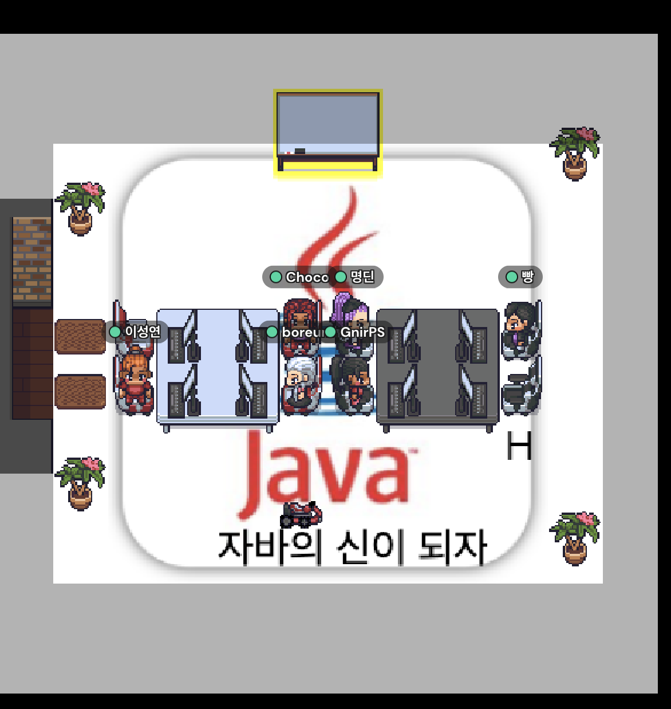

## 1주차

### 🙋🙋‍♀️ 회의 안건
#### &nbsp;&nbsp;&nbsp;&nbsp;&nbsp;1. 팀 선정
#### &nbsp;&nbsp;&nbsp;&nbsp;&nbsp;2. 발표 팀 선정
#### &nbsp;&nbsp;&nbsp;&nbsp;&nbsp;3. 공부량
#### &nbsp;&nbsp;&nbsp;&nbsp;&nbsp;4. 차 주 공부 시간(9/24, 9/25)

### 📝 회의 내용
### 1. 팀 선정
#### &nbsp;&nbsp;&nbsp;&nbsp;&nbsp;1팀
```
1. 허보름 - 조장
2. 이성연
3. 이현정
```
    
#### &nbsp;&nbsp;&nbsp;&nbsp;&nbsp;2팀
```
1. 김영재 - 조장
2. 김명진
3. 노상문
```
### 2. 발표 팀 선정
&nbsp;&nbsp;&nbsp;&nbsp;&nbsp;```2팀```
### 3. 공부량
&nbsp;&nbsp;&nbsp;&nbsp;&nbsp;```4장```
### 4. 차 주 공부 시간
&nbsp;&nbsp;&nbsp;&nbsp;&nbsp;```9월 24일 토요일 09:00```

### 📝 발표 준비 범위
- ```1, 2장``` - ```김영재```   
- ```3장``` - ```김명진```   
- ```4장``` - ```노상문```

### 📝 발표팀 외 준비 사항
- 4장까지 공부 후 모르겠는 사항 정리해서 발표팀이 발표 후 질문하기
- 하나 이상은 반드시 질문하기

### 발표 종료 후 진행사항
- 발표 준비한 내용 및 질문사항 md 파일로 각 주 각 팀 폴더에 업로드
- 파일 이름은 개인의 닉네임 또는 이름
- ```ex) /progress/2-week/2-Team/KimYoungJae.md```

### 출석 체크

### ⭐⭐⭐⭐⭐️ 전원 참석!
