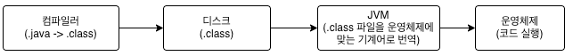

# 2장 Hello God Of Java

### 해당 장에서 배울 것
- IDE 없이 자바 프로그램을 컴파일 및 실행하는 방법
- 자바 코드의 실행 과정
- main() 메소드에 대해서
- 주석에 대해서

### 자바의 코드 실행 과정
1. 코드 작성(```.java``` 파일 생성)
2. 컴파일(```javac``` 명령어 이용 -> ```.java``` 파일을 기반으로 ```.class``` 파일 생성)
3. 실행(```java``` 명령어 이용 -> ```.class``` 파일 실행)

> ### 참고1) 컴파일이란?
> - 대부분의 프로그래밍 언어들은 텍스트로 된 파일을 실행 할 수가 없다.
> - 그래서 개발자가 작성한 프로그래밍 언어들을 컴퓨터가 읽을 수 있게 해주는 과정을 컴파일이라고 한다.
> - 자바에서는 개발자가 작성한 코드를 ```JVM```이 읽을 수 있게 해주는 과정이다.

> ### 참고2) 자바 프로그램 실행 과정
> 
> 1. 자바 컴파일러가 ```.java``` 파일을 ```.class```파일로 변경한다.
> 2. 변경 된 ```.class``` 파일을 하드디스크에 저장된다.
> 3. ```.class``` 파일을 ```JVM```이 읽어 ```운영체제```가 이해할 수 있는 기계어로 번역한다.
> 4. ```운영체제```는 ```JVM```이 번역한 기계어를 읽고 프로그램을 실행한다.

> ### 참고3) ```.class``` 파일
> - ```.class``` 파일은 바이너리 파일이다.
> - ```바이너리(binary)``` 파일이란?
>   - ```바이너리```는 0과 1로 구성되어 있는 2진법을 의미
>   - 즉, ```바이너리``` 파일은 2진수로 채워져 있는 파일을 말한다.
>   - 사람은 글자로 읽는 것이 편하고 빠르겠지만, 컴퓨터는 2진 파일을 읽는 것이 편하고 빠르기(```성능이 좋다는 뜻```) 때문에 컴퓨터가 읽기 위한 파일들은 대부분 ```바이너리```로 되어 있다.

### 자바 프로그램을 컴파일하고 실행해보기
- 아마 대부분은, 어떤 프로그래밍 언어를 입문할 때에 우선 ```Hello World```를 찍어볼 것이다.
- 이 책에서는 책의 이름을 따서 ```Hello God of Java !!!```를 콘솔 창에 출력 하는 것이 예시로 나와 있다.
- 프로그램은 같은 폴더 안의 ```Book-Example.java``` 파일로 만들었다.
- 해당 폴더 위치로 이동
    ```shell
    $ cd {디렉토리 위치}/Java-Study/progress/2-week/1-Team/KimYoungJae/Chapter2
    ```
  - {디렉토리 위치} : 해당 폴더의 상위 폴더인 ```Java-Study```의 상위 디렉토리
  - ```cd``` : 디렉토리 이동 명령어
  - ```cd ..``` : 상위 디렉토리로 이동
  - ```cd {디렉토리 위치}``` : 해당 디렉토리 위치로 이동
- 해당 폴더에서 ```Book-Example.java``` 파일 컴파일
    ```shell
    $ javac Book-Example.java
    ```
  - ```Book-Example.java``` 파일 안의 ```class```명에 따라 ```.class``` 파일 생성
  - ```Book-Example.java```의 ```class``` 명은 ```HelloGodOfJava```
- ```.class``` 파일 실행
  ```shell
  $ java HelloGodOfJava
  ```
  - ```Hello God Of Java !!!```가 실행 되는지 확인

> ### 참고4) ```.java``` 파일명과 ```.java```파일 내의 ```class```명은 같아야 한다?
> - ```class``` 타입 앞에 접근제어자가 있는 경우는 두 개의 이름이 같아야 하지만, 접근 제어자가 없는 경우는 두 개의 이름이 달라도 상관 없으며, 컴파일 시 ```class```명으로 파일이 생성된다.
> - ```Book-Example.java``` 내의 ```public class HelloGodOfJava```는 ```class``` 앞에 접근 제어자가 있으므로 컴파일 에러
> - ```Book-Example.java``` 내의 ```class HelloGodOfJava```는 ```class``` 앞에 접근 제어자가 없으므로 ```HelloGodOfJava```라는 이름으로 컴파일 된 파일 생성

### Java의 ```main()``` 메소드
- java 명령으로 시작하는 모든 자바 클래스는 ```main()```메소드를 기준으로 프로그램이 시작 된다.
- 즉, ```main()``` 메소드가 없으면, 해당 자바 프로그램은 돌아가지 않는다.

> ### 참고5) Spring Boot에서는 main() 메소드가 어디 있나요?
> - 패키지 최상단 ```*Application.java``` 파일에 존재
> - ```SpringApplication.run()```를 실행 시켜, 해당 파일 하위에 있는 파일들을 ㅇ릭는다. 
 
### ```main()``` 메소드의 구조
```java
public static void main(String[] args) {
}
```
- java의 ```main()``` 메소드는 반드시 위와 같이 선언되어야 한다.
- 위와 같이 선언하지 않을 경우, 자바는 프로그램을 실행 할 수 없다고 생각하여, 해당 프로그램을 실행 하지 않는다.
- 다만, 여기서 매개 변수인 ```args```의 이름만은 유일하게 변경해도 아무 문제가 없다.

### 메소드 분해해보기
```java
public static(1) void(2) main(3)(String[] args(4)) throws Exception(5) {
    //메소드 내용(6)    
}
```
1. 제어자
  - ```modifier```
  - 해당 메소드를 어디서 접근할 수 있을지, 정하는 특성
2. 리턴 타입
  - ```return type```
  - 메소드 실행 시 반환 되는 타입
3. 메소드 이름
  - ```method name```
  - 소괄호 앞에 있는 메소드 이름을 말한다.
4. 매개 변수 목록
  - ```paramter list```
  - 소괄호 안에 있는 매개 변수의 목록
5. 예외 목록
  - ```exception list```
  - 메소드 실행 시 에러가 날 경우 실행 되는 예외
  - 14장에서 자세히 설명한다.
6. 메소드 내용
  - ```method body```
  - 메소드 실행 시 작동되는 내용

> ### 참고6) 괄호 명칭 짚고 가기
> 기호|명칭|
> ---|---|
> ()|소괄호|
> {}|중괄호|
> []|대괄호|

### 화면에 데이터를 출력하는 메소드
- ```System.out.print("출력할 내용물")```
  - ```출력할 내용물```을 콘솔에 출력해준다.
  - 줄바꿈은 하지 않는다.
- ```System.out.println("출력할 내용물")```
  - ```출력할 내용물```을 콘솔에 출력해준다.
  - ```System.out.print()```와 다르게, 줄바꿈을 한다.

### 주석
- ```comment```
- 파일 내에는 존재하나 실행 되지 않는 코드를 만들기 위해서는 주석처리를 하면 된다.

### 한줄 주석
- ```//```
- 해당 기호 이후에 코드들은 프로그램 실행 시 실행되지 않는다.
- 해당 기호가 있는 줄에만 적용된다.
- ex) ```Systme.out.println("출력"); //출력을 출력한다.```
- 위 예시에서 ```출력을 출력한다.``` 라는 부분은 프로그램 실행 시 아무런 영향도 주지 않는다.

### 블록 주석
- ```/* */```
- 해당 기호 사이에 있는 코드들은 프로그램 실행 시 실행되지 않는다.
  ```java
  ex)
  /*
    System.out.println("출력1");
    System.out.println("출력2");
    System.out.println("출력3");
   */
  System.out.println("출력4");
  ```
  - 위의 코드가 실행 시, ```출력4```만 출력된다.

### 문서용 주석
- ```documentation comment```
- ```/** */```
- 클래스나, 메소드 위에 주로 붙이는 주석으로, 해당 주석을 선언 시 다른 클래스에서 해당 클래스 혹은 메소드를 사용 시 설명한 주석이 보이게 된다.
- 추가 내용은 ```11장```에서 참고 할 수 있다.